# Three.js Lab Codex Plugin

Local Codex marketplace plugin for production-grade 3D learning labs, Three.js models, physics simulation, optimization, and QA.

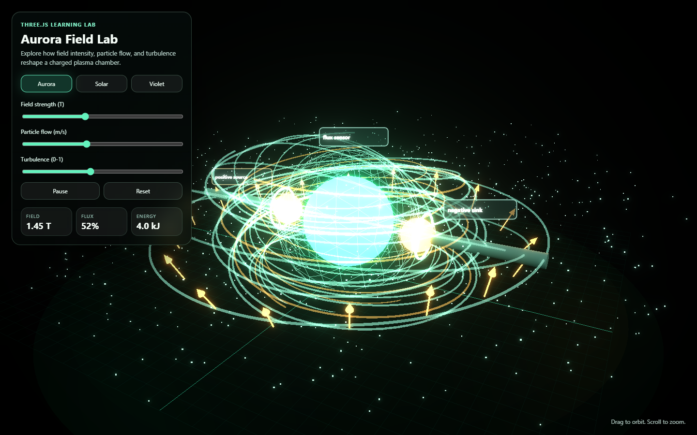

## One-Command Install

Requirements: Codex CLI, Node.js, Git, and GitHub access to this private repo.

PowerShell:

```powershell
powershell -NoProfile -ExecutionPolicy Bypass -Command "$repo='https://github.com/HungBil/threejs-lab-codex-plugin.git'; $dir=Join-Path $env:TEMP 'threejs-lab-codex-plugin'; if (Test-Path (Join-Path $dir '.git')) { git -C $dir pull --ff-only } else { git clone $repo $dir }; node (Join-Path $dir 'scripts/install.mjs')"
```

Bash:

```bash
bash -lc 'repo="https://github.com/HungBil/threejs-lab-codex-plugin.git"; dir="${TMPDIR:-/tmp}/threejs-lab-codex-plugin"; if [ -d "$dir/.git" ]; then git -C "$dir" pull --ff-only; else git clone "$repo" "$dir"; fi; node "$dir/scripts/install.mjs"'
```

Start a new Codex thread after installing so the skill metadata is loaded.

For an existing checkout, run:

```bash
node scripts/install.mjs
```

## Why This Exists

Most 3D lab prompts fail in the same places: pretty canvas but weak learning goal, no units, no reset, broken mobile layout, missing asset path, fake physics, or no browser evidence. This plugin gives Codex a tighter workflow for shipping real learning-lab scenes instead of decorative demos.

## Skills

| Skill | Use It For | Main Effect |
| --- | --- | --- |
| `$threejs-lab` | Any 3D/canvas/Three.js lab prompt | Routes to the specific specialist skill and enforces baseline scene lifecycle. |
| `$learning-lab-3d-creator` | Full educational experiments, lesson scenes, agent-connected labs | Creates a lab contract, file split, controls, units, result loop, reset, and verification path. |
| `$science-model-director` | Science logic, causality, variable mapping, simplification risk | Blocks beautiful but scientifically weak scenes before implementation. |
| `$threejs-design-director` | 3D morphology, composition, reference interpretation, annotation-vs-object calls | Blocks generic shapes, copied sketch artifacts, and illogical 3D object choices. |
| `$threejs-art-director` | Reference likeness, material polish, composition, non-toy aesthetics | Blocks demos that benchmark well but still look crude or unlike the input reference. |
| `$visual-lab-qa-agent` | Fancy/demo visual quality, GPT Image/imagegen references, screenshot comparison | Runs before and after each demo: creates a visual target, compares benchmark screenshots, and loops on `FIX_REQUIRED`. |
| `$khtn8-biology-lab-creator` | KHTN8 biology, human body, ecology, dense small-detail scenes | Requires recognizable biological systems, detail-marker coverage, mobile FE checks, and stricter model/texture budgets. |
| `$threejs-model-creator` | Procedural models, GLB/GLTF, materials, apparatus, labels | Keeps models semantic, scaled, articulated, optimized, and disposable. |
| `$threejs-physics-simulation` | Forces, fields, collisions, particles, density, heat, optics, rigid bodies | Chooses formula/custom solver/`cannon-es`/Babylon physics with units and fixed timestep where needed. |
| `$threejs-performance-qa` | Blank canvas, asset 404s, slow scenes, release checks | Requires build, browser/canvas checks, responsive framing, cleanup, and performance budget. |
| `$learning-lab-qa-pm-reviewer` | Final review before merge/demo/shipping | Acts as the strict PM/QA gate: `PASS`, `PASS_WITH_NOTES`, or `BLOCKED`. |

## What It Does

- Routes 3D prompts to the right specialist skill through a Codex hook.
- Pushes new labs toward a clear contract: lesson goal, variables, units, controls, measured output, reset, QA command.
- Adds a locked visual QA loop: generate or write a reference target before coding, record prompt/reference/fix rounds, compare desktop/mobile benchmark screenshots after coding, and keep fixing until `PASS` or a concrete blocker.
- Keeps Three.js scene lifecycle boring and reliable: camera, renderer, loop, resize, asset loading, cleanup.
- Adds a strict reviewer gate so a lab is not "done" until build, browser, canvas, interaction, mobile, physics, and asset evidence exist.

## Expected Workflow

1. Ask Codex to use `$learning-lab-3d-creator` for a complete lab or `$threejs-model-creator` for a model-heavy asset.
2. Run `$science-model-director` to map controls -> visible changes -> measured outputs.
3. Run `$threejs-design-director` to choose real 3D objects, morphology anchors, camera composition, and annotation rules.
4. Run `$threejs-art-director` to block toy-like visuals, weak materials, poor composition, and low reference likeness.
5. Run `$visual-lab-qa-agent` start pass before coding the demo. If GPT Image/imagegen is available, it should create object-focused reference sheets; otherwise it writes a compact visual target spec.
6. Record the prompt/reference/screenshot/fix loop in demo notes, a PR summary, or an evidence file. Missing loop evidence blocks visual `PASS`.
7. Use `$threejs-physics-simulation` when the lab has real formulas, collisions, forces, fields, or solver behavior.
8. Run `$threejs-performance-qa` after code changes to generate benchmark screenshots and metrics.
9. Run `$visual-lab-qa-agent` end pass. If it returns `FIX_REQUIRED`, apply the smallest concrete fix set and repeat the end pass.
10. Run `$learning-lab-qa-pm-reviewer` before saying the lab is ready.

## Visual QA Loop

This is the guardrail for the exact failure mode where a demo benchmarks well but still looks weak. `$visual-lab-qa-agent` treats machine metrics as budget checks, not proof of beauty.

Required evidence per serious demo:

- A visual target prompt/spec before implementation.
- A prompt loop ledger with prompt/spec, reference path, science/design gate verdicts, screenshot path, benchmark path, fix set, and final verdict.
- Desktop and mobile benchmark screenshots after implementation.
- A `PASS`, `FIX_REQUIRED`, or `BLOCKED` visual QA verdict.
- For Chemistry: credible apparatus, visible reaction evidence, material separation, scale/measurement cues.
- For Biology: recognizable organ/specimen/ecosystem structure, dense small details, flow/signal markers, scale cues, and FE detail-marker budget.
- For every fix loop: concrete scene changes only, such as geometry, material, lighting, camera, label, interaction, or asset-budget action.

For the KHTN demo set, the loop ledger is `examples/khtn8-subject-labs/VISUAL_QA_LOG.md`.

## Engine Choice

Default new school/curriculum labs to Three.js for speed, bundle control, DOM/UI fit, and simple scene ownership. Keep Babylon for existing game-like worlds or physics surfaces that already depend on Babylon architecture. Do not rewrite working Babylon scenes just to standardize.

## Benchmark Demos

These demos are intentionally dependency-light: each is one HTML file plus Three.js from CDN. Visual quality is for human review; the benchmark script measures the parts machines can judge.

| Demo | Source Topic | What To Benchmark |
| --- | --- | --- |
| `examples/density-buoyancy-lab/` | A20 density/KHTN8 density and buoyancy | mass, displaced volume, buoyant force, sink/float state, render/resource metrics |
| `examples/coulomb-force-lab/` | A20 Coulomb simulation | q1/q2/r, force, attraction/repulsion, arrows, render/resource metrics |
| `examples/fancy-field-lab/` | stress/fancy field visualizer | particle/field visual load, glow/material polish, state/reset, render/resource metrics |
| `examples/khtn8-subject-labs/` | KHTN 8 KNTT chemistry, physics, biology chapters | 9 subject labs, FE detail checks, mesh/texture/model-size budgets |

### KHTN 8 Subject Labs

These are selected from the local `KHTN 8-KNTT.pdf` table of contents: chemistry reaction/acid-base/rate, physics pressure/moment/electricity, and biology circulation/respiration/ecosystem. Each lab has 3+ controls, 3 measured outputs, reset, browser benchmark hooks, and formula self-checks.

| Subject | Lab | URL | What It Teaches |
| --- | --- | --- | --- |
| Chemistry | Reaction Gas | `examples/khtn8-subject-labs/index.html?lab=chem-reaction-gas` | gas formation, limiting reagent, rate cues |
| Chemistry | Acid Base pH | `examples/khtn8-subject-labs/index.html?lab=chem-acid-base` | neutralization, pH, indicator color |
| Chemistry | Catalyst Rate | `examples/khtn8-subject-labs/index.html?lab=chem-catalyst-rate` | temperature, catalyst, surface area, reaction speed |
| Physics | Fluid Pressure | `examples/khtn8-subject-labs/index.html?lab=phys-pressure` | pressure, depth, density, force on area |
| Physics | Lever Moment | `examples/khtn8-subject-labs/index.html?lab=phys-lever` | moment of force, balance, torque direction |
| Physics | Electric Circuit | `examples/khtn8-subject-labs/index.html?lab=phys-circuit` | voltage, resistance, current, bulb brightness |
| Biology | Circulation | `examples/khtn8-subject-labs/index.html?lab=bio-circulation` | heart output, vessel resistance, pulse flow |
| Biology | Respiration | `examples/khtn8-subject-labs/index.html?lab=bio-respiration` | lung expansion, ventilation, oxygen uptake |
| Biology | Ecosystem Balance | `examples/khtn8-subject-labs/index.html?lab=bio-ecosystem` | producers, consumers, pollution, stability |

### Benchmark Screenshots

These screenshots are generated by `scripts/benchmark-examples.mjs` from the same desktop/mobile runs as the metrics.

| Demo | Desktop Benchmark | Mobile Benchmark |
| --- | --- | --- |
| Density buoyancy | 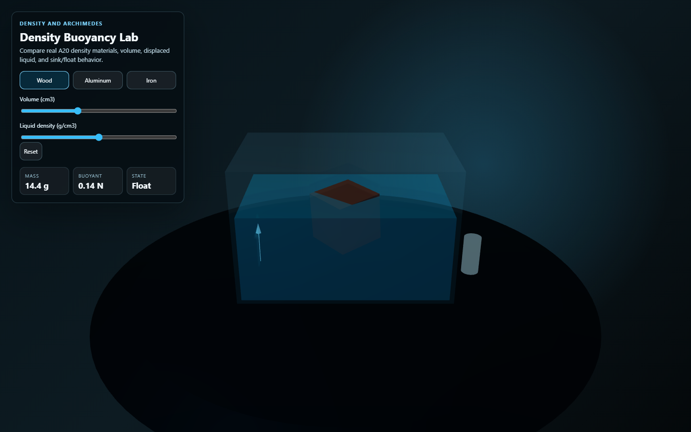 | 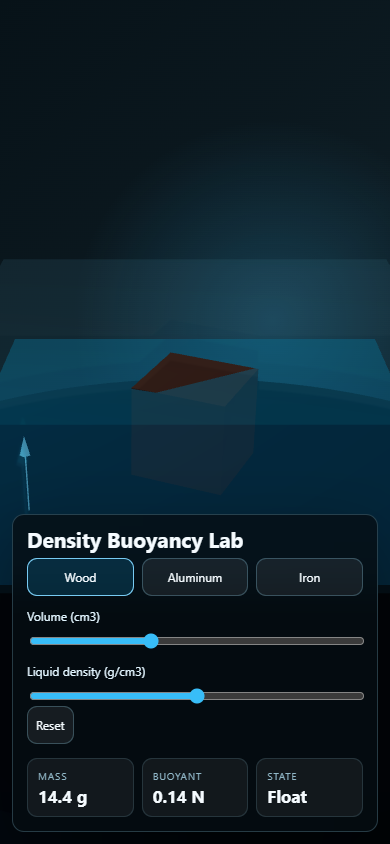 |
| Coulomb force | 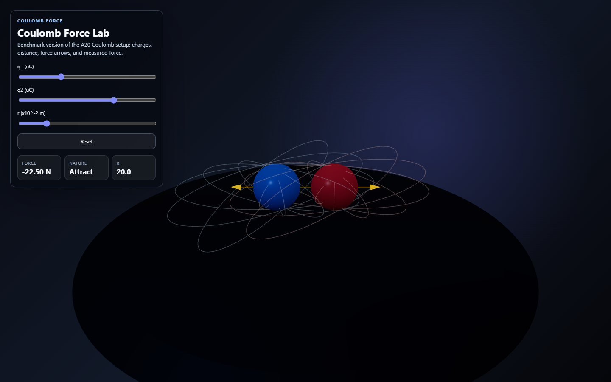 | 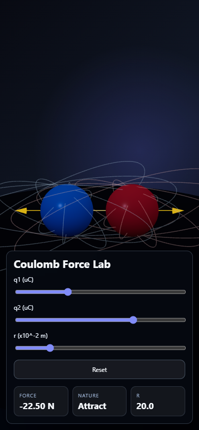 |
| Fancy field | 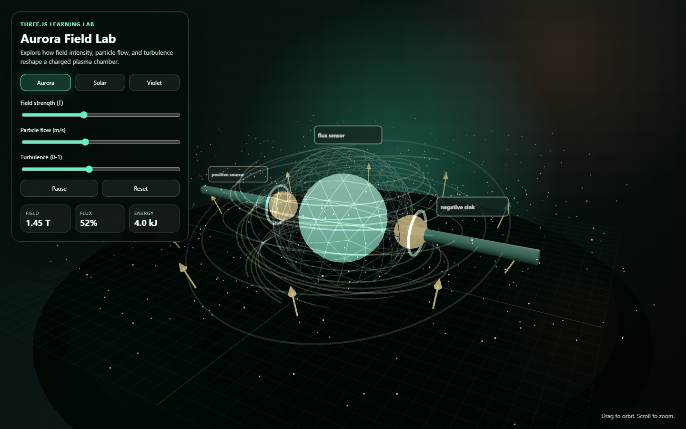 | 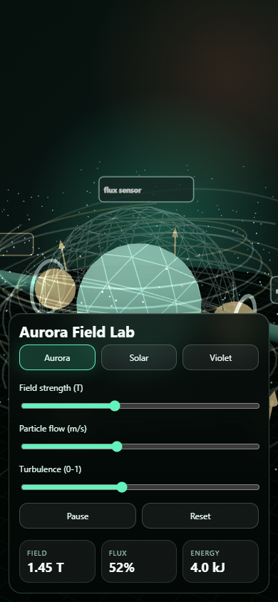 |
| KHTN Chemistry gas | 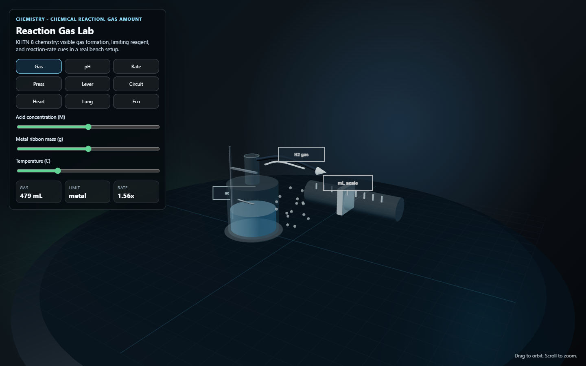 | 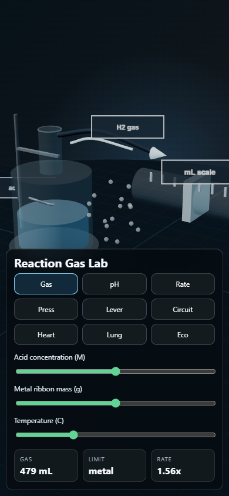 |
| KHTN Physics circuit | 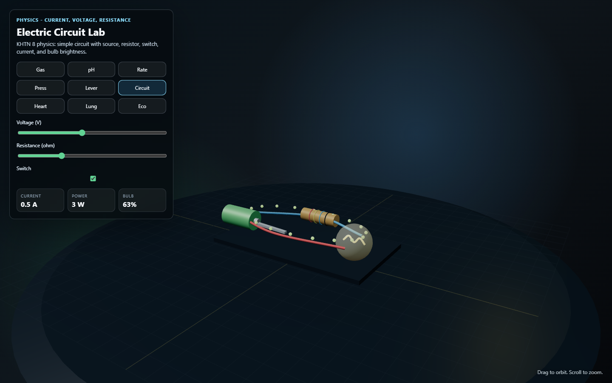 | 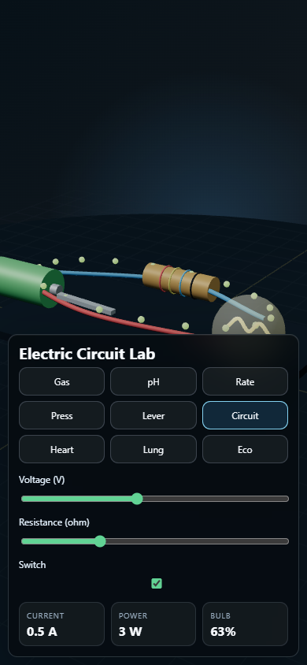 |
| KHTN Biology circulation | 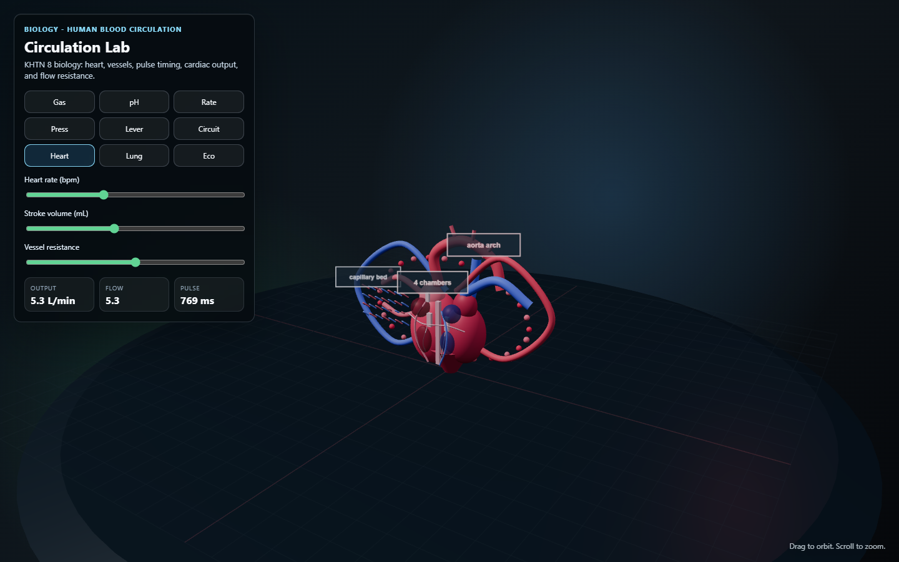 | 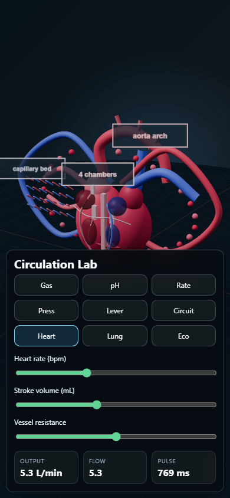 |
| KHTN Biology respiration | 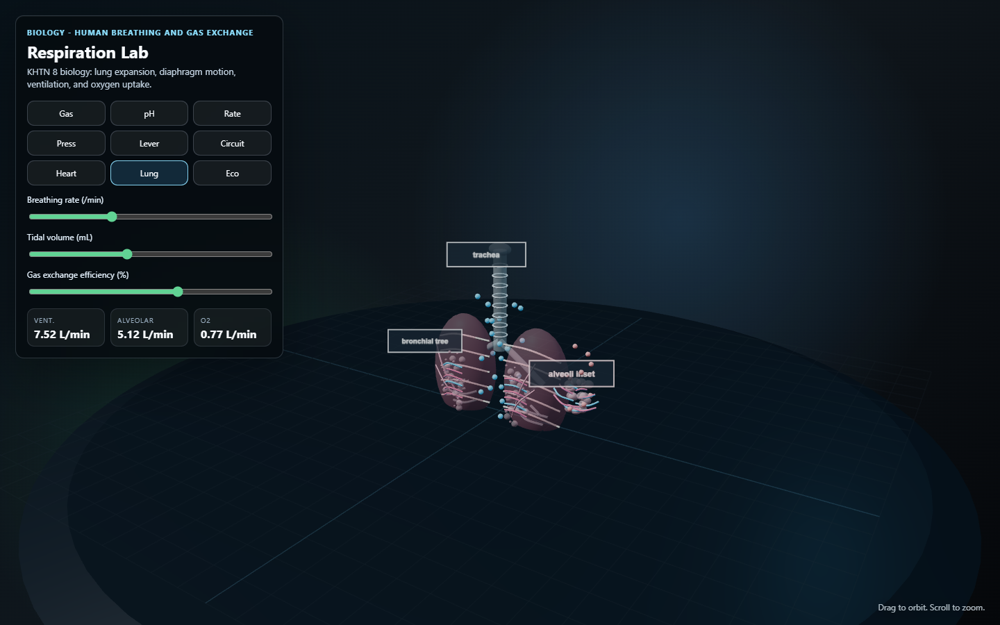 | 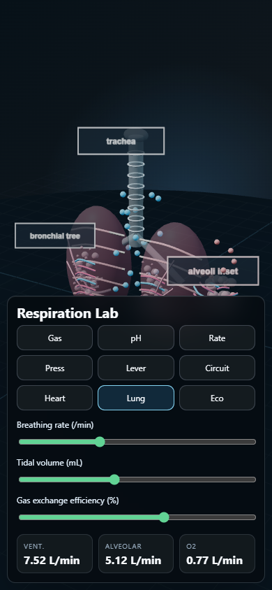 |
| KHTN Biology ecosystem | 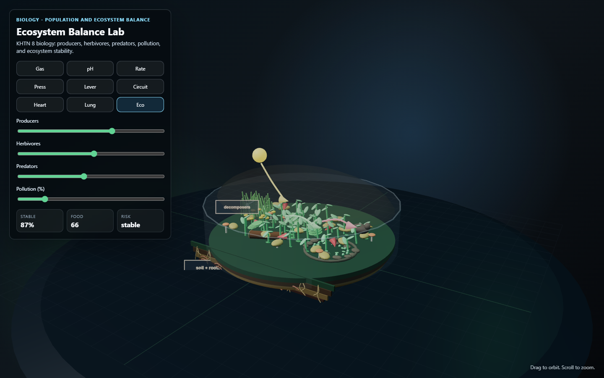 | 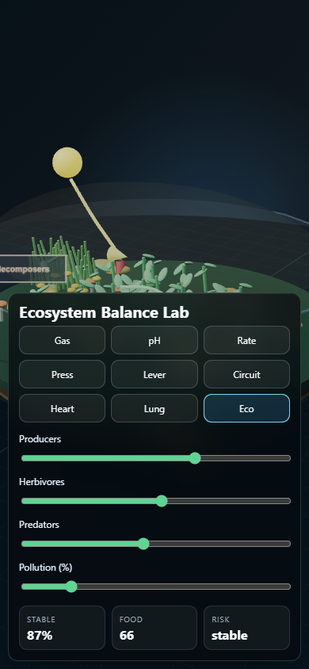 |

### 2D Reference To 3D Biology Output

The biology demos keep the generated 2D input references next to the benchmark screenshots so reviewers can compare morphology, not just FPS. The full prompt/fix history is in `examples/khtn8-subject-labs/VISUAL_QA_LOG.md`.

| Lab | 2D Reference Input | 3D Desktop Output | 3D Mobile Output |
| --- | --- | --- | --- |
| Circulation | 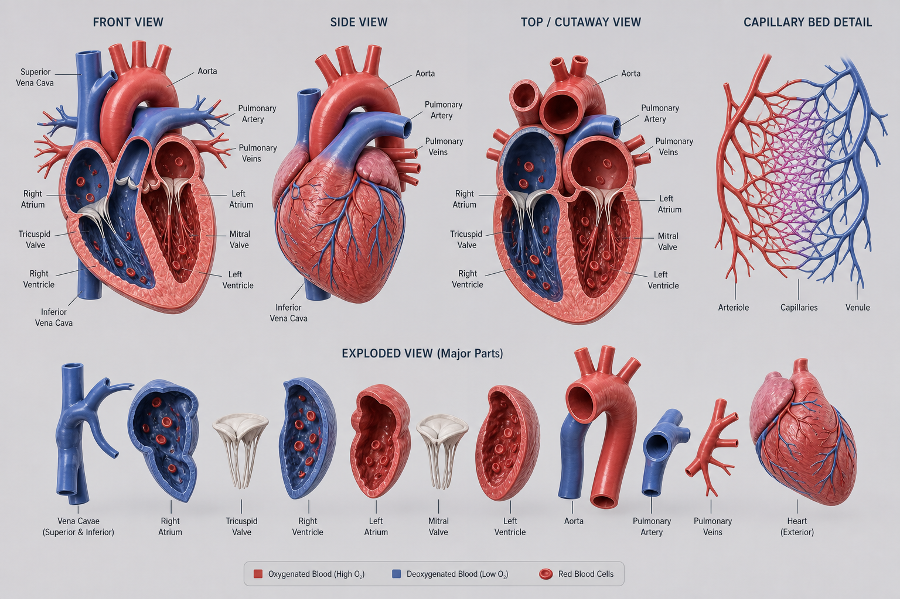 |  |  |
| Respiration | 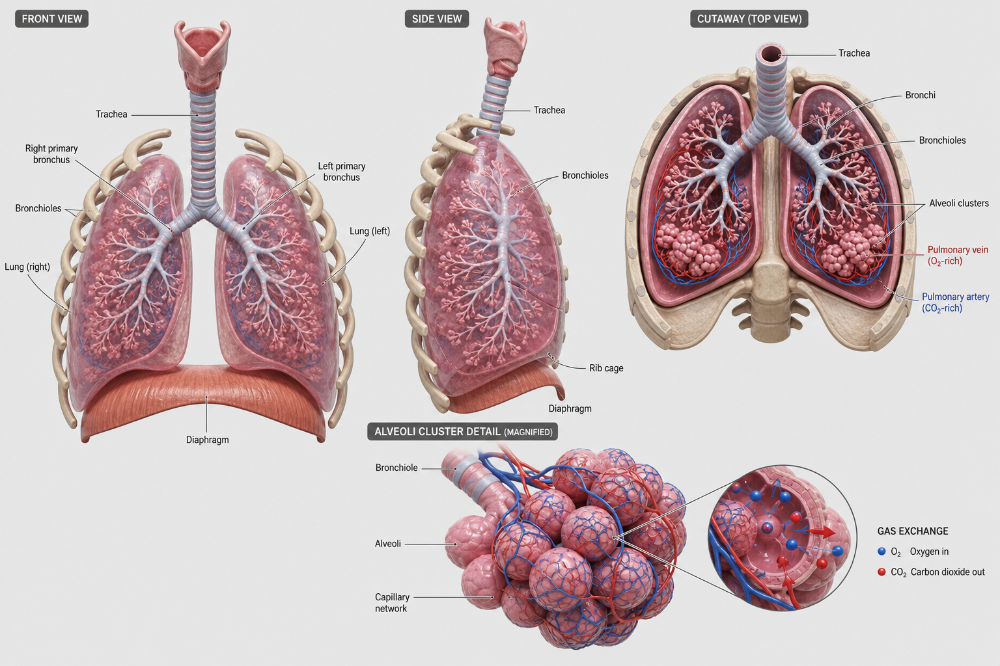 |  |  |
| Ecosystem | 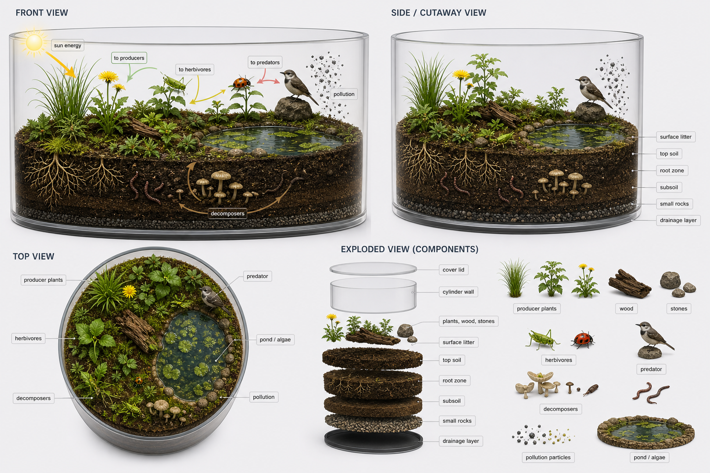 |  |  |

### Optimization Benchmark Highlights

Current run: 24/24 desktop/mobile benchmark profiles pass. The point is not just "pretty"; each demo proves render budget, state integrity, reset, responsive layout, local asset size, model size, texture size, and FE fit.

Read the FPS numbers as browser-frame pacing, not maximum GPU throughput. Headless Chrome and `requestAnimationFrame` can sit near the display/runtime cadence, so the stronger optimization signals are p95 frame time, draw calls, triangles, texture count, transfer size, and whether state mutation/reset stays deterministic. The benchmark takes two warmed frame-pacing runs per viewport, disables headless background throttling, closes pages between profiles, and keeps the steadier run to avoid false failures from transient headless/GC spikes.

| Demo Profile | FPS vs >=55 | P95 Frame vs <=25ms | Draw Calls vs <=180 | Geometry Load | Textures vs <=16 | Transfer vs <=900KB | State |
| --- | ---: | ---: | ---: | ---: | ---: | ---: | --- |
| Fancy field desktop | 63 FPS (+15%) | 21.0 ms (16% under) | 44 (76% under) | 15,010 tris, 520 points | 4 (75% under) | 389 KB (57% under) | mutate/reset ok |
| Fancy field mobile | 144 FPS (+162%) | 7.1 ms (72% under) | 33 (82% under) | 14,730 tris, 520 points | 4 (75% under) | 0 KB | mutate/reset ok |
| Density buoyancy desktop | 60 FPS (+9%) | 21.0 ms (16% under) | 11 (94% under) | 964 tris | 2 (88% under) | 0 KB | mutate/reset ok |
| Density buoyancy mobile | 126 FPS (+129%) | 13.9 ms (44% under) | 10 (94% under) | 836 tris | 2 (88% under) | 0 KB | mutate/reset ok |
| Coulomb force desktop | 129 FPS (+135%) | 13.9 ms (44% under) | 22 (88% under) | 4,820 tris | 1 (94% under) | 0 KB | mutate/reset ok |
| Coulomb force mobile | 144 FPS (+162%) | 7.1 ms (72% under) | 22 (88% under) | 4,820 tris | 1 (94% under) | 0 KB | mutate/reset ok |

KHTN 8 subject labs are dependency-light: each profile loads `72 KB` of local code/assets, `0 MB` model assets, and `0 MB` texture assets because the apparatus is procedural. This is intentional for curriculum labs: use GLB only when shape fidelity teaches the concept.

| KHTN Lab | Desktop/Mobile FPS | P95 Frame | Draw Calls | Geometry | Local Size | Model / Texture |
| --- | ---: | ---: | ---: | ---: | ---: | ---: |
| Reaction Gas | 104 / 144 | 14.0 / 7.1 ms | 45 | 8,858 tris | 72 KB | 0 / 0 MB |
| Acid Base pH | 123 / 144 | 14.0 / 7.1 ms | 37 | 6,826 tris | 72 KB | 0 / 0 MB |
| Catalyst Rate | 115 / 144 | 14.0 / 7.1 ms | 71 | 13,026 tris | 72 KB | 0 / 0 MB |
| Fluid Pressure | 119 / 144 | 14.0 / 7.0 ms | 27 | 2,348 tris | 72 KB | 0 / 0 MB |
| Lever Moment | 122 / 144 | 14.0 / 7.1 ms | 22 | 926 tris | 72 KB | 0 / 0 MB |
| Electric Circuit | 111 / 144 | 14.1 / 7.1 ms | 34 | 11,072 tris | 72 KB | 0 / 0 MB |
| Circulation | 98 / 144 | 14.1 / 7.1 ms | 87 | 62,030 tris, 71 detail markers | 72 KB | 0 / 0 MB |
| Respiration | 91 / 144 | 14.1 / 7.1 ms | 151 | 99,788 tris, 162 detail markers | 72 KB | 0 / 0 MB |
| Ecosystem Balance | 77 / 144 | 20.9 / 7.1 ms | 110 | 94,986 tris, 644 detail markers | 72 KB | 0 / 0 MB |

What is deliberately optimized:

- Formula-based simulations for density and Coulomb force; no physics engine where equations are enough.
- Procedural Three.js geometry; no GLB/model payload for these curriculum labs.
- Capped pixel ratio, resize-safe canvas, and no heavy postprocessing in the stress demo.
- Low texture pressure: 1-6 renderer textures per demo, all under the 16-texture budget.
- Low draw-call pressure: 10-151 calls, all under the 180-call budget.
- Asset-size pressure is measured: local loaded code/assets <=512 KB, largest model <=3 MB, loaded textures <=4 MB.
- Biology FE is stricter: no text overflow, no small touch targets, and `detailMarkers >= 20` for dense biology scenes.
- Dense biology exceptions are explicit: respiration and ecosystem exceed the 60k default triangle guideline for morphology detail, but pass p95 frame, draw-call, texture, mobile, and asset-size budgets.
- State benchmark hooks: each demo exposes mutate/reset checks so controls must change measured output and reset must restore initial state.
- Desktop/mobile screenshots and panel-bounds checks come from the same benchmark run as the numbers.

### Interaction And Physics Coverage

| Demo | Interaction Covered | Physics/Simulation Covered | What This Proves | Not Yet Covered |
| --- | --- | --- | --- | --- |
| Density buoyancy | material buttons, volume slider, liquid-density slider, orbit, reset | `mass = density * volume`, displaced volume, buoyant force, sink/float branch | formula lab can stay small, measurable, and responsive | real fluid dynamics, collision/contact solver |
| Coulomb force | q1/q2 sliders, distance slider, orbit, reset | signed Coulomb force, attraction/repulsion, force arrows, distance clamp | force lab can expose units, result, sign, and vector feedback without a physics engine | many-body field solver, charge trajectories |
| Fancy field | presets, strength/flow/turbulence sliders, pause/play, orbit, reset | fixed-step animated field visualization, particles, vector cues | stress scene can keep visual richness under render/resource budgets | physically accurate electromagnetic solver |

Current benchmark suite is intentionally not a complete physics-engine benchmark. It does not yet prove rigid bodies, joints, constraints, cloth/fluid simulation, GLB texture streaming, long-run memory stability, agent report flow, or quiz/chatbot integration. Add those as separate demos when those capabilities matter; mixing them into these small A20-style labs would make the benchmark less readable.

Run the benchmark harness:

```bash
node scripts/benchmark-examples.mjs
```

Current benchmark evidence is summarized in `examples/BENCHMARK_RESULTS.md`; the full machine-readable output is `examples/benchmark-results.json`.

It reports:

- FPS average and p95 frame time.
- load time and resource transfer.
- renderer info: draw calls, triangles, points, lines, geometries, textures.
- asset size: loaded local code/assets KB, largest model MB, loaded texture MB.
- canvas size, pixel ratio, and sampled canvas coverage.
- state mutation latency and reset integrity.
- desktop/mobile panel bounds, touch target size, text overflow, and biology detail markers.

Physics correctness is covered by the tiny per-demo self-checks:

```bash
node examples/density-buoyancy-lab/self-check.mjs
node examples/coulomb-force-lab/self-check.mjs
node examples/fancy-field-lab/self-check.mjs
node examples/khtn8-subject-labs/self-check.mjs
```

Prompt shape that this repo is designed to support:

```text
Use $learning-lab-3d-creator and $threejs-physics-simulation to build an A20-style density or Coulomb lab with live controls, units, reset, render metrics, state metrics, browser QA, and strict PM review.
```

## Hooks

- Plugin hook: `plugins/threejs-lab/hooks/hooks.json` routes 3D/physics prompts toward the right skill.
- Git hook: run `bash scripts/setup_hooks.sh` once to install a pre-push validator.

## Add A Skill

```bash
node scripts/new-skill.mjs my-skill "Use when ..."
node scripts/validate.mjs
```

Then reinstall:

```bash
node scripts/install.mjs
```

## Contents

- `.agents/plugins/marketplace.json`
- `examples/density-buoyancy-lab/`
- `examples/coulomb-force-lab/`
- `examples/fancy-field-lab/`
- `examples/khtn8-subject-labs/`
- `plugins/threejs-lab/.codex-plugin/plugin.json`
- `plugins/threejs-lab/hooks/`
- `plugins/threejs-lab/skills/`
- `scripts/`

## Validation

```bash
node scripts/validate.mjs
bash .git/hooks/pre-push
```

`scripts/check-threejs-lab.mjs` is the small static checker for changed scene files. It catches missing camera/loop/resize/cleanup patterns and common GLB/physics omissions.
`scripts/validate.mjs` also checks the KHTN biology visual QA ledger, 2D references, desktop/mobile screenshots, and 24-profile benchmark JSON.
